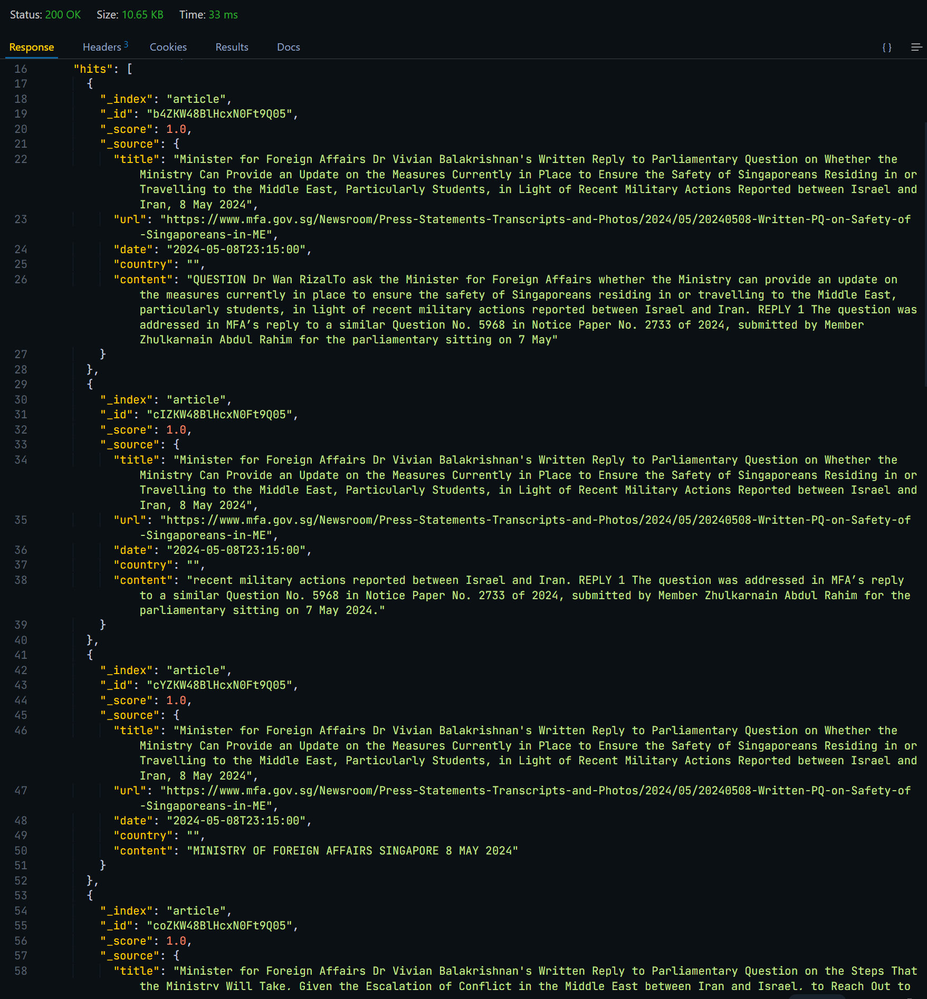

# MFA-PressData
|  | <div align="center"><span style="font-size: large;">**MFA press statements scraped from official websites.<br><br>Separated by countries and dates.<br><br>Cleaned, processed, and ingested into Elasticsearch for easy searching and analysis.**</span></div> |
| --- | --- |

This project is part of PopFigExpert.
1. Scrape and clean press statements from the websites
> Function `scrape()` handles the scraping and the cleaning. This includes selecting the correct elements, and handling the weird spacing of the text.


2. Chunk the press statements into smaller chunks
> Each doucment can range from 100 - 5000+ characters. We need to equalize the size of the chunks, because it will be fed into our RAG system.


3. Store the chunks in Elasticsearch
> Bulk store the documents into elasticsearch.

4. **Extra**: Playing around with retrieval
> Trying methods to abstract the data retrieval.

## Data Structure

### TypeScript
```typescript
type ArticleSearchResult = {
  title: string;
  url: string;
  date: string;
  country: string;
  content: string;
}
```

### Elasticsearch index mappings
```python
index_mappings = {
  "mappings": {
    "properties": {
      "date": {"type": "date"},
      "title": {"type": "text"},
      "url": {"type": "text"},
      "country": {"type": "text"},
      "content": {"type": "text"},
    }
  }
}
```


## Dependencies
The notebook requires the following dependencies:

Python 3.x
Jupyter Notebook
Pandas
Requests
Langchain & Tiktoken to split text into chunks